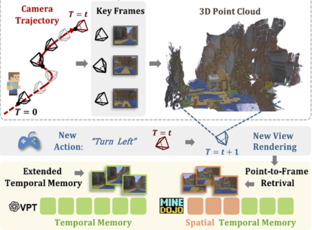
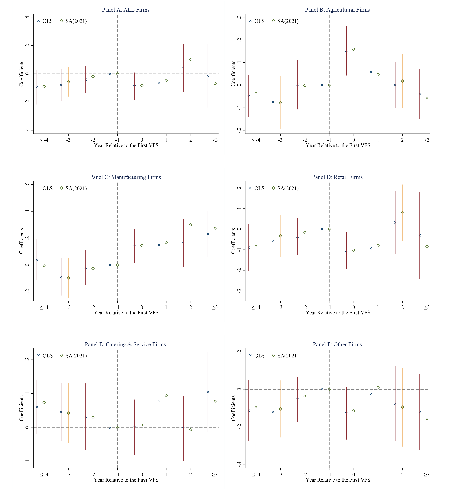
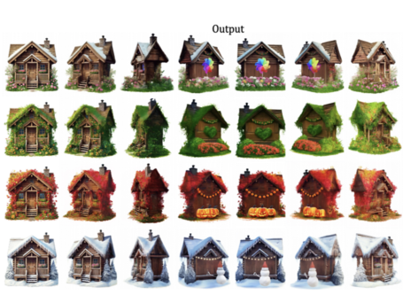

Selected Work
------

  <table style="border-collapse: collapse; border: none;">
    
  <tr><td width="300" style="border: none;">
  

  </td>
  <td style="border: none;">
  

    
<a href="https://www.sciencedirect.com/science/article/abs/pii/S0304387825001609"><b>Solving Coordination Failures: Collective Land Transfer Rights and Rural Entrepreneurship</b></a>

    
Strengthening communal land transfer rights enhances rural entrepreneurship—particularly in areas where collective coordination is more feasible—by reducing land use costs and increasing local land wealth.

  

  </td></tr>

  <tr><td width="300" style="border: none;">
  

  </td>
  <td style="border: none;">
  

    
<b>The Role of Weather Forecasts in Climate Adaptation and Reducing Medical Costs in China</b>

    
Improving forecast accuracy significantly reduces morbidity and medical spending, with mispredictions—especially under extreme weather—driving sizable increases and highlighting information as a cost-effective adaptation.

  

  </td></tr>

  <tr><td width="300" style="border: none;">
  

  </td>
  <td style="border: none;">
  

    
<b>Heating For Health: Cold Adaptation, Pollution Trade-Offs, and Distributional Impacts of Winter Heating on Medical Expenditure</b>

    
Winter district heating cuts medical expenses and visits via cold adaptation, but pollution offsets about two-thirds of the gains and disproportionately harms rural and non-CDHS-covered residents.

  

  </td></tr>
  
  </table>

 

Work in Progress
------
- When the Fields Fail: Floods and Labor Reallocation in China
  With Jinze Cao (NUS), Haoyu Gao (RUC), Yu Qin (NUS)  
- Building for Brilliance: The Impact of University Expansion on Research Output
  With Shilin Zheng (CASS), Zhenglong Cong (RUC)  
- Connection or Competition: The Heterogeneous impact of Rural Broadband on rural firms
  With Eddie C.M. Hui (CityU), Jianfu Shen (PolyU)  
- Bridging Jobs and Affordable Homes: Job-affordable Housing Proximity and Local Growth
  With Kun Lv (RUC) and Ping Lv (RUC)   
 

<!---->
